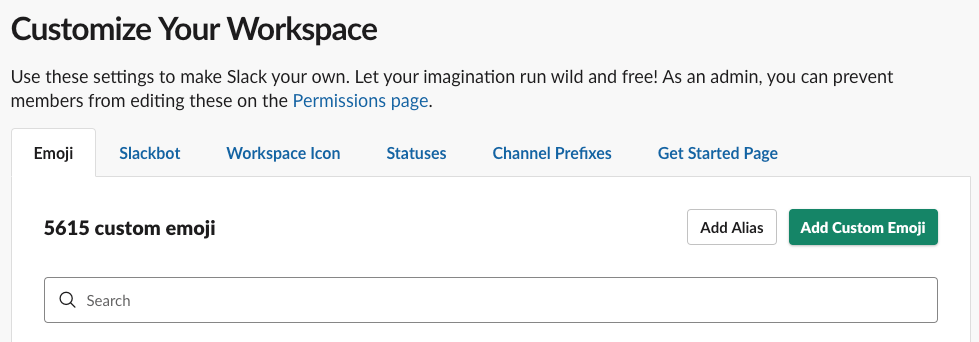
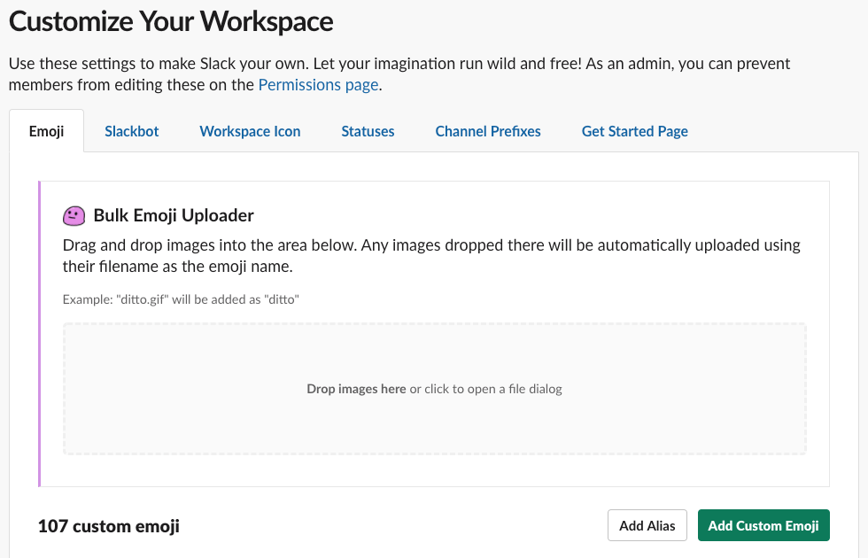
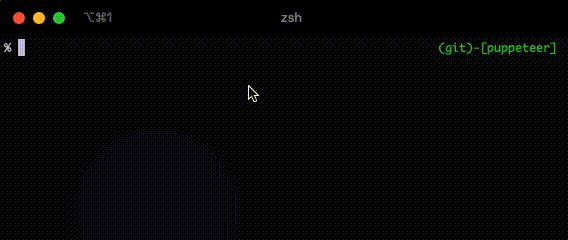

# インストール

**カスタム絵文字の追加には権限が必要です。**

ゲスト以外のメンバーが追加可能ですが、管理者によって制限されている場合があります。

公式サイトの解説ページ「[カスタム絵文字を追加する](https://slack.com/intl/ja-jp/help/articles/206870177)」

## マニュアルで登録する

ブラウザでワークスペースにログインし、フォームから登録してください。

[https://<your_workspace>.slack.com/customize/emoji](https://<your_workspace>.slack.com/customize/emoji)

| /customize/emoji |
| :--- |
|  |

### Chromeエクステンション

[Neutral Face Emoji Tools](https://chrome.google.com/webstore/detail/neutral-face-emoji-tools/anchoacphlfbdomdlomnbbfhcmcdmjej) をGoogle Chromeにインストールすると、Drag&Dropでまとめて追加可能です。

| Neutral Face Emoji Tools |
| :--- |
|  |

ただし、一度に100個以上を追加しようとしたり、連続してたくさんの画像を D&D すると登録に失敗するようです。


## スクリプトで登録する

[Puppeteer](https://github.com/puppeteer/puppeteer) を使ってコマンドラインからデコモジを自動追加できます。

プロジェクトルートで依存パッケージをインストールしてください。Node.js は v12.16.3 を利用します。

```bash
npm ci
```

```bash
node scripts/manager
```

対話式でチーム名、アカウント、パスワード、追加するデコモジのカテゴリーを入力できます。

| CLI |
| :--- |
|  |

### チーム名などを json ファイルに保存し実行を簡略化する

まず `scripts/manager/inputs.json.example` を雛形に `scripts/manager/inputs.json` を保存してください。

登録スクリプトに `--inputs` オプションを付与することで `inputs.json` の情報がログインに使われます。

```bash
node scripts/manager --inputs
```

`--inputs` オプションをつけると対話式の入力インターフェースは起動せず、すぐに登録処理が実行されます。

基本セット（Basic）と拡張セット（Extra）の両方を登録するのに60分ほどかかりますので、お昼休憩前や業後に実行することをお勧めします。