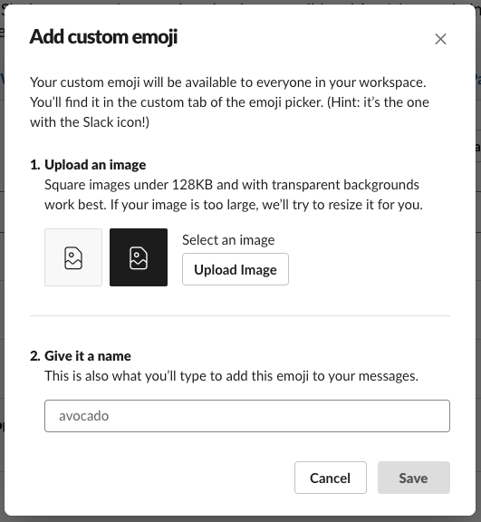

# インストール

**カスタム絵文字の追加には権限が必要です。**

ゲスト以外のメンバーが追加可能ですが、管理者によって制限されている場合があります。

公式サイトの解説ページ「[カスタム絵文字を追加する](https://slack.com/intl/ja-jp/help/articles/206870177)」

### マニュアルで登録する

ブラウザでSlackチームにログインし、フォームから登録してください。

[https://<your_team_name>.slack.com/customize/emoji](https://<your_team_name>.slack.com/customize/emoji)

### Chromeエクステンション

[Neutrak Face Emoji Tools](https://chrome.google.com/webstore/detail/neutral-face-emoji-tools/anchoacphlfbdomdlomnbbfhcmcdmjej) をGoogle Chromeにインストールすると、Drag&Dropでまとめて追加可能です。ただし一度に100個以上を追加しようとするといくつか失敗する模様です。

### スクリプトで登録する

WIP