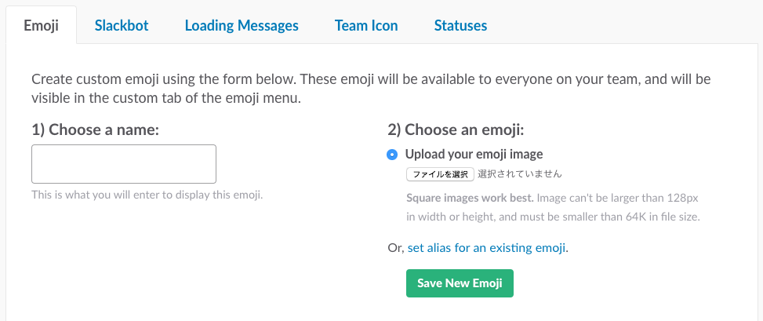

# インストール

**Slackアカウントに管理者権限が必要です。**

### マニュアルで登録する

[https://{{your-team-name}}.slack.com/customize/emoji](https://{{your-team-name}}.slack.com/customize/emoji)

ブラウザでSlackチームにログインし、フォームから登録してください。



### Chromeエクステンション

['Slack Emoji Tools'](https://chrome.google.com/webstore/detail/slack-emoji-tools/anchoacphlfbdomdlomnbbfhcmcdmjej) をGoogle Chromeにインストールすると、Drag&Dropでまとめて追加可能です。


### スクリプトで登録する

**Ruby v2.5.1**と**bundler**が必要です。

```bash
git clone git@github.com:decomoji/slack-reaction-decomoji.git
cd slack-reaction-decomoji/scripts/
bundle install
bundle exec ruby import.rb
```

コマンドラインで上記の手順で必要なモジュールをインストールしてください。

`import.rb`を実行すると、チーム名とあなたのアカウントとパスワードを聞かれるのでそれぞれ入力してください。`decomoji/basic/`にあるファイルが一つずつ登録されていきます。同じファイル名のカスタム絵文字がすでにある場合はスキップされます。


#### スクリプトで拡張セットを登録する

拡張セット用の.rbファイルを実行してください。

```bash
bundle exec ruby import.rb extra
```

### Dockerを使って登録する

#### Docker for macをダウンロード＆インストールする
[https://docs.docker.com/docker-for-mac/install/](https://docs.docker.com/docker-for-mac/install/)  
【Download from Docker Hub】→【Please Login To Download】  
※Docker Hubのアカウント登録が必要です。  

#### コンテナを使ってスクリプトを登録する
```bash
git clone git@github.com:decomoji/slack-reaction-decomoji.git
cd slack-reaction-decomoji/
docker-compose run --rm app bundle exec ruby import.rb
```

`import.rb`を実行すると、チーム名とあなたのアカウントとパスワードを聞かれるのでそれぞれ入力してください。`decomoji/basic/`にあるファイルが一つずつ登録されていきます。同じファイル名のカスタム絵文字がすでにある場合はスキップされます。


#### 拡張セットを登録する

```bash
docker-compose run --rm app bundle exec ruby import.rb extra
```
