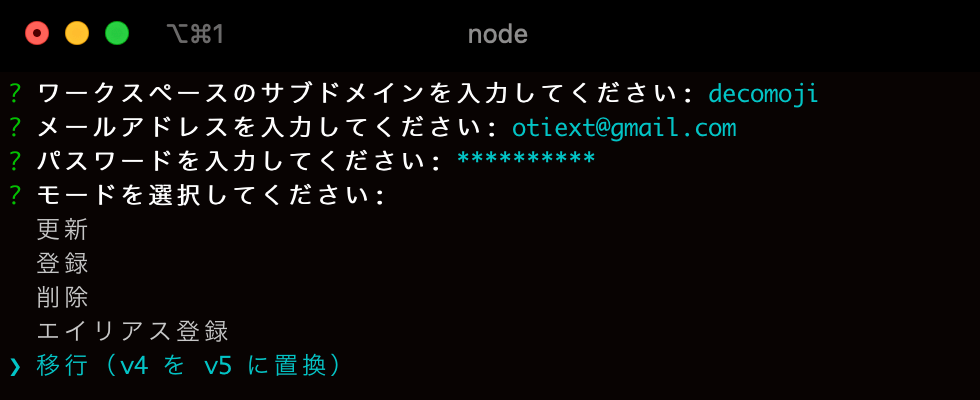

# decomoji v5

「デコモジ（decomoji）」は Slack のリアクション機能で使える最強カスタム絵文字セットです。このプロジェクトではそれら一つ一つを「デコモジ」と呼んでいます。


## デコモジの特徴

<dl>
<dt>🎨カラフルなテキスト画像</dt><dd>見やすい 12 のカラーパレットで Slack に彩を添えます！</dd>
<dt>🌓ダークモード対応</dt><dd>調整を重ねたカラーパレットにより背景を暗くしてもデコモジなら読めます！</dd>
<dt>🍱職人による割中レイアウト</dt><dd>2 行取りをベースに、長い言葉は 3 行取りにレイアウトしました！</dd>
<dt>📦圧倒的な物量</dt><dd>全体で 5000 個以上あるデコモジなら使いたいリアクションが必ず見つかります！</dd>
<dt>🤖登録と削除の自動スクリプト</dt><dd>膨大なデコモジもコマンドラインから自動でインストール！</dd>
</dl>

デコモジはテキストを書き込んだ画像ファイルです。略語、字詰め、ワクワク感にこだわりました。

ハイコンテキスト！　だから使って楽しい！

デコモジはあなたのワークスペースに**カルチャーとベロシティを提供**します！


## まずは基本セットから始めましょう

デコモジには 3 つのカテゴリがあります。まずは基本セットの 300 個をあなたのワークスペースに登録してしばらく使ってみてください。

物足りなさを感じたら拡張セットも登録しましょう。Slack がもっと楽しくなります！

デコモジ一覧は下記ドキュメントで確認できますが、リンク先のドキュメントにアクセスすると**超大量に画像ファイルを通信する**のでご注意ください。

- [基本セット](docs/LIST-basic.md): すぐに使えて Slack が楽しくなるセットです。
- [拡張セット](docs/LIST-extra.md): 基本セットと合わせるとさらに Slack が便利で楽しくなるセットです。
- 露骨セット: 性的なもの、暴力的なもの、露骨な表現で使用には注意が必要なものを隔離したセットです。多くの場合、使わない方が良いです。

## デコモジを探す

「この言葉ってデコモジにあったっけ？」デコモジが多すぎでわからなくなりますよね。

そんな時は[デコモジファインダー](https://finder.decomoji.dev/?size=ll&category=basic)を使ってみてください。正規表現でも検索できます！

## ワークスペースへの登録方法

**カスタム絵文字の登録・削除には権限が必要です。**

デコモジをあなたのワークスペースに登録する方法は 3 つあります。

1. 絵文字登録ページのフォームから一つずつ登録する
2. Chrome 用のエクステンション [Slack Custom Emoji Manager](https://chrome.google.com/webstore/detail/slack-custom-emoji-manage/cgipifjpcbhdppbjjphmgkmmgbeaggpc) で Drag&Drop で登録する
3. スクリプトでコマンドラインから一括登録・削除する

次のセクションで 3 つ目の方法について解説しています。

### スクリプトでコマンドラインから一括登録・削除する

この操作はエンジニア向けです。実行には Node.js v12.16.3 が必要です。

プロジェクトルートで依存パッケージをインストールしてからターミナル等で Node コマンドを実行してください。

```bash
npm ci
node scripts/manager
```


対話式でワークスペース、アカウント、パスワード、登録か削除、対象のデコモジカテゴリーを入力すると、自動で処理が始まります。

2FA ログインを利用している場合は数時間かかる可能性があります。できれば 2FA を解除してから実行してください。

### v4 から v5 への移行



モード選択で「移行（v4 を v5 に置換）」を選択すると、v4 時代の古いデコモジを削除してから v5 の新しいデコモジを登録します。また、古いファイル名から新しいファイル名へのエイリアスも登録されます。

このモードでは基本セットと拡張セットが登録されます。

### v5 の差分更新

v5.0.0 を登録したのち、v5.1.x 以降の差分を登録したい場合は、モード選択で「更新」を選んで実行してください。

このモードでは基本セットと拡張セットが登録されます。

## フー・ユーズ・デコモジ？

あなたの所属する組織のチームやコミュニティでデコモジが使われていたら、ぜひ「Who use decomoji?」リポジトリに追加して教えてください！

[who-use-decomoji](https://github.com/decomoji/who-use-decomoji)

## サポートするには

Patreon で支援を受け付けています。

<a href="https://www.patreon.com/bePatron?u=486549"></a>

## その他のドキュメント

- [高度な管理方法](docs/ADVANCED.md)
- [コントリビューティングガイドライン](docs/CONTRIBUTING.md)
- [デコモジファイルの命名規則](docs/NOTATIONS.md)
- [チェンジログ](docs/CHANGES.md)

## スペシャルサンクス！

これらのデコモジは、imaz 氏が作成した`:naruhodo:`に影響を受け生み出されました。改めて深く感謝を申し上げます。

[@imaz](https://github.com/imaz/), [@geckotang](https://github.com/geckotang/), [@ginpei](https://github.com/ginpei/), [@watilde](https://github.com/watilde/), [@matori](https://github.com/matori/), [@fukayatsu](https://github.com/fukayatsu/), [@maiha2](https://github.com/maiha2/), [@webcre8](https://github.com/webcre8/), [@masuP9](https://github.com/masuP9/), [@yuheiy](https://github.com/yuheiy), [@kubosho](https://github.com/kubosho) and All Contributors!

## ライセンス

Copyright (c) 2015 decomoji consortium and other contributors.

Under the [MIT License](LICENSE).
