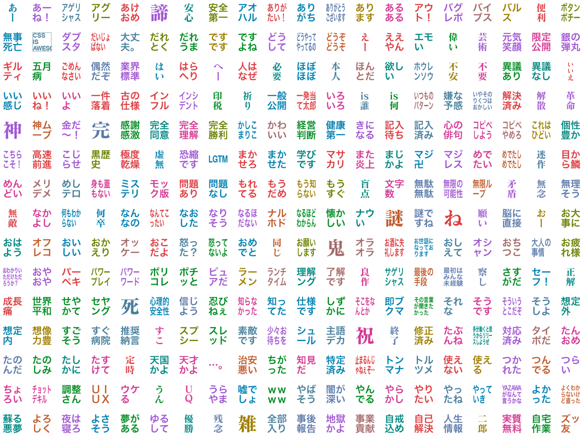
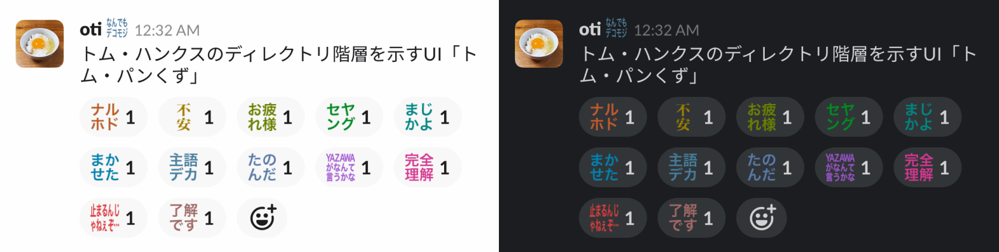
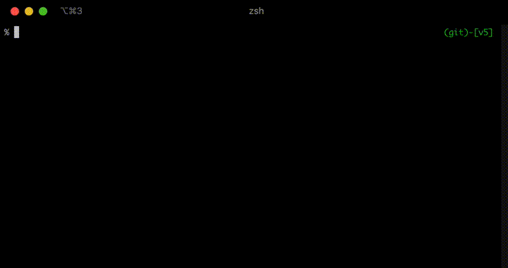

# decomoji v5-preview

v5の制作がなかなか進まないので、`decomoji/preview/` にプレビュー版として作ったデコモジを順次追加していくことにしました。

このブランチはパブリックベータを兼ねています。

v5 には削除スクリプトを搭載する予定であり、プレビュー版にも含まれています。ですが **このブランチでのテストが不十分なので、利用によって生じた損害について一切の責任は負いません。**

それゆえ、あえて npm run-script に追加していません。利用の際はスクリプトファイルをよく読み、実装を完全に理解した上で実行してください。

---

**ダークモードでも読めるように改良した v5 のプレビュー版があります**

https://github.com/decomoji/slack-reaction-decomoji/pull/63

是非お試しください。

---



Slack のリアクション機能で使えるカスタム絵文字のアセットです。このプロジェクトではそれら一つ一つを「デコモジ」と呼んでいます。

## Slack で使うとこうなります



これらのデコモジは、[@imaz](https://github.com/imaz)氏が作成した`:naruhodo:`に影響を受け生み出されました。

## 特徴

1. カラフルなテキスト画像
2. 割注レイアウトで読みやすい
3. 高精細ディスプレイ対応
4. リアクションだけでなくステータスや平文にも

デコモジはテキストを書き込んだ画像ファイルです。略語、字詰め、ワクワク感にこだわりました。

ハイコンテキスト！　だから使って楽しい！　デコモジは迅速なコミュニケーションを可能にします。

---

## 基本セットと拡張セット

デコモジには 2 つのカテゴリがあります。リンク先のドキュメントにアクセスすると**画像ファイルが超大量に参照される**のでご注意ください。

- [基本セット](docs/decomoji-basic.md): 基本セットは、すぐに使えて Slack が楽しくなるセットです
- [拡張セット](docs/decomoji-extra.md): 拡張セットは、作りたいと思った気持ちのままに作ったセットです

## ワークスペースへの登録

**カスタム絵文字の追加には権限が必要です。**

デコモジをあなたのワークスペースに登録する方法は 3 つあります。

1. 絵文字登録ページのフォームから一つずつ登録する
2. Chrome 用のエクステンション [Neutral Face Emoji Tools](https://chrome.google.com/webstore/detail/neutral-face-emoji-tools/anchoacphlfbdomdlomnbbfhcmcdmjej) を使って Drag&Drop で登録する
3. スクリプトでコマンドラインから一括登録・削除する

次のセクションで 3 つ目の方法について解説しています。

### スクリプトでコマンドラインから一括登録・削除する

この操作はエンジニア向けです。実行には Node.js v12.16.3 が必要です。

プロジェクトルートで依存パッケージをインストールしてから Node コマンドを実行してください。

```bash
npm ci
node scripts/manager
```



対話式でチーム名、アカウント、パスワード、追加か削除、実行するデコモジのカテゴリーを入力すると、自動で処理が始まります。全てのデコモジを追加・削除するのに 60 分ほどかかります。

## フー・ユーズ・デコモジ？

あなたの所属する組織のチームやコミュニティでデコモジが使われていたら、ぜひ「Who use decomoji?」リポジトリに追加して教えてください！

[who-use-decomoji](https://github.com/decomoji/who-use-decomoji)

## サポートするには

Patreon で支援を受け付けています。

<a href="https://www.patreon.com/bePatron?u=486549"></a>

## その他のドキュメント

- [高度な管理方法について](docs/ADVANCED.md)
- [コントリビューティングガイドラインについて](docs/CONTRIBUTING.md)
- [デコモジファイルの命名規則について](docs/NOTATIONS.md)
- [チェンジログ](docs/CHANGES.md)

## スペシャルサンクス！

[@imaz](https://github.com/imaz/), [@geckotang](https://github.com/geckotang/), [@ginpei](https://github.com/ginpei/), [@watilde](https://github.com/watilde/), [@matori](https://github.com/matori/), [@fukayatsu](https://github.com/fukayatsu/), [@maiha2](https://github.com/maiha2/), [@webcre8](https://github.com/webcre8/), [@masuP9](https://github.com/masuP9/), [@yuheiy](https://github.com/yuheiy), [@kubosho](https://github.com/kubosho) and All Contributors!

## ライセンス

Copyright (c) 2015 decomoji consortium and other contributors.

Under the [MIT License](LICENSE.txt).
