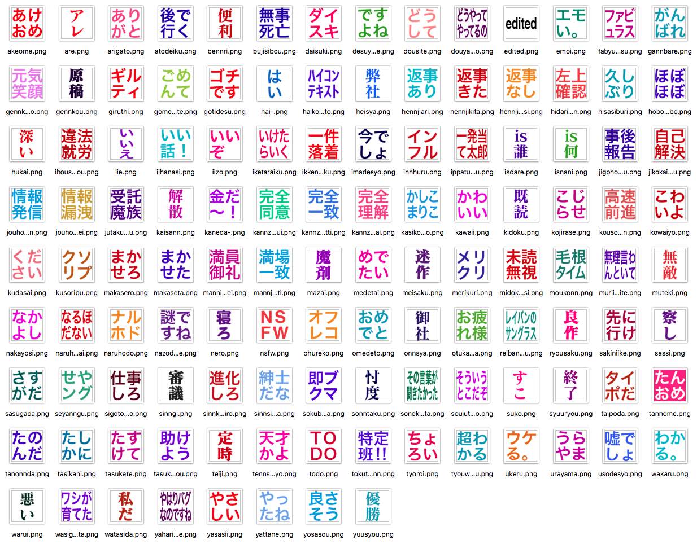
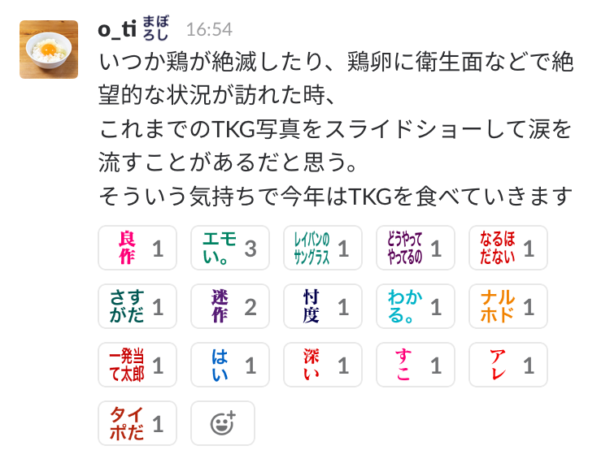

# decomoji v4

Slackのリアクション機能で使えるカスタム絵文字のアセットです。このプロジェクトではそれら一つ一つを「デコモジ」と呼んでいます。

## Slackで使うとこうなります

これらのデコモジは、[@imaz](https://github.com/imaz)氏が作成した`:naruhodo:`に影響を受け生み出されました。

## 特徴

1. カラフルなテキスト画像
2. 割注レイアウトで読みやすい
3. 高精細ディスプレイ対応
4. リアクションだけでなくステータスや平文にも

デコモジはテキストを書き込んだ画像ファイルです。略語、字詰め、ワクワク感にこだわりました。

ハイコンテキスト！　だから使って楽しい！　デコモジは迅速なコミュニケーションを可能にします。

---

## インストール

[INSTALLATION.md](INSTALLATION.md)

## 基本セットと拡張セット

[docomoji-basic.md](decomoji-basic.md)

基本セットは、すぐに使えてSlackが楽しくなるセットです。

[docomoji-extra.md](decomoji-extra.md)

拡張セットは、作りたいと思った気持ちのままに作ったセットです。

## コントリビューティング

[CONTRIBUTING.md](CONTRIBUTING.md)

## ファイル名ルール

[NOTATIONS.md](NOTATIONS.md)

訓令式ローマ字がベースです。

## ライセンス

Copyright (c) 2015 decomoji consortium and other contributors.

Under the [MIT License](LICENSE.txt).

## チェンジログ

[CHANGES.md](CHANGES.md)

## Who use decomoji?

[who-use-decomoji](https://github.com/decomoji/who-use-decomoji)

あなたの所属する組織のSlackチームでデコモジが使われていたら、ぜひ「Who use decomoji?」リポジトリに追加してください。Issueで教えてもらってもいいですし、編集してプルリクエストを投げてもらってもよいです！

## えっ支援したいって！？

ありがとうございます！　Patreonにページを作りました！

https://www.patreon.com/decomoji

## スペシャルサンクス！

[@imaz](https://github.com/imaz/) / [@geckotang](https://github.com/geckotang/) / [@ginpei](https://github.com/ginpei/) / [@watilde](https://github.com/watilde/) / [@matori](https://github.com/matori/) / [@fukayatsu](https://github.com/fukayatsu/) / [@maiha2](https://github.com/maiha2/) / [@webcre8](https://github.com/webcre8/) / [@masuP9](https://github.com/masuP9/) / [@yuheiy](https://github.com/yuheiy) / [@kubosho](https://github.com/kubosho)

