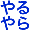

# Slack Reaction Decomoji v3

Slackリアクション機能で使えるカスタム絵文字のアセットです。このプロジェクトではそれら一つ一つを「デコモジ」と呼んでいます。


これらのデコモジは、[@imaz](https://github.com/imaz)氏が作成した`:naruhodo:`に影響を受け生み出されました。

## デコモジ一覧

[decomoji-list.md](decomoji-list.md)に羅列しています。

## コントリビューティングガイドライン

[CONTRIBUTING.md](CONTRIBUTING.md)を参照してください。

## 特徴

1. テキスト画像
2. だいたい4文字
3. 割注レイアウトで読みやすい
4. 色とりどり
5. JUMBOMOJIに対応
6. 高精細ディスプレイに対応

デコモジはテキストを書き込んだ画像ファイルです。日本語特有の「4文字略語」の文化を継承し画像に落とし込みました。これにより迅速でハイコンテキストなコミュニケーションが可能です。

## ポリシー



### やること

- 不定期なデコモジの追加
- 文字色や字詰めの修正
- ファイル名やスクリプトのミスの修正

### やらないこと

- デコモジの追加・削除要望受付
- 一度追加したデコモジの削除

## インストール

**Slackアカウントに管理者権限が必要です。**

### マニュアルで登録する

[https://{{your-team-name}}.slack.com/customize/emoji](https://{{your-team-name}}.slack.com/customize/emoji)

ブラウザでSlackチームにログインし、フォームから登録してください。


### Chromeエクステンション

['Slack Emoji Tools'](https://chrome.google.com/webstore/detail/slack-emoji-tools/anchoacphlfbdomdlomnbbfhcmcdmjej) をGoogle Chromeにインストールすると、Drag&Dropでまとめて追加可能です。


### スクリプトで登録する

Rubyとbundlerが必要です。

```bash
$ git clone git@github.com:oti/slack-reaction-decomoji.git
$ cd slack-reaction-decomoji/scripts/
$ bundle install
$ bundle exec ruby import.rb
```

コマンドラインで上記の手順で必要なモジュールをインストールしてください。

`import.rb`を実行すると、チーム名とあなたのアカウントとパスワードを聞かれるのでそれぞれ入力してください。`decomoji/`にあるファイルが一つずつ登録されていきます。同じファイル名のカスタム絵文字がすでにある場合はスキップされます。


## ライセンス

MIT

## Change Log

### v3は破壊的変更を含んでいます

- 既存デコモジのリファイン
  - 色の修正
  - 使用フォントの統一
  - ファイル名の修正
- ライセンスをCC BY-NC 3.0からMITに変更

「つ」が `tu` と `tsu` で混在していたので `tu` に統一しました。他のローマ字表記も可能な限り短くなるようにしています。

v3から営利目的のサービスにデコモジを組み込めるようになりました。ライセンスの変更については賛否あるかと思いますが何卒ご了承ください。

### v2は破壊的変更を含んでいます

#### 1. JUMBOMOJIに対応

v2ではデコモジは64px角にサイズアップしました。

v1（無印）からのアップデートをしようとしているなら、既存のデコモジをSlackチームからあらかじめ削除しておく必要があります。Slackの設定画面ではカスタム絵文字の上書き保存はできませんので注意してください。

#### 2. ファイル名の統一

ローマ字表記を[JIS X4063:2000で定義されたフォーマット](https://ja.wikipedia.org/wiki/%E3%83%AD%E3%83%BC%E3%83%9E%E5%AD%97%E5%85%A5%E5%8A%9B#.E5.BF.85.E3.81.9A.E5.AE.9F.E8.A3.85.E3.81.97.E3.81.AA.E3.81.91.E3.82.8C.E3.81.B0.E3.81.84.E3.81.91.E3.81.AA.E3.81.84.E5.85.A5.E5.8A.9B.E6.96.B9.E5.BC.8F)に統一しました。

----

## Special Thanks

[@imaz](https://github.com/imaz/)(オリジナルの`:naruhodo:`の作者)

[@geckotang](https://github.com/geckotang/)  
[@ginpei](https://github.com/ginpei/)  
[@watilde](https://github.com/watilde/)  
[@matori](https://github.com/matori/)  
[@fukayatsu](https://github.com/fukayatsu/)  
[@maiha2](https://github.com/maiha2/)  
[@webcre8](https://github.com/webcre8/)  
[@masuP9](https://github.com/masuP9/)  
[@yuheiy](https://github.com/yuheiy)