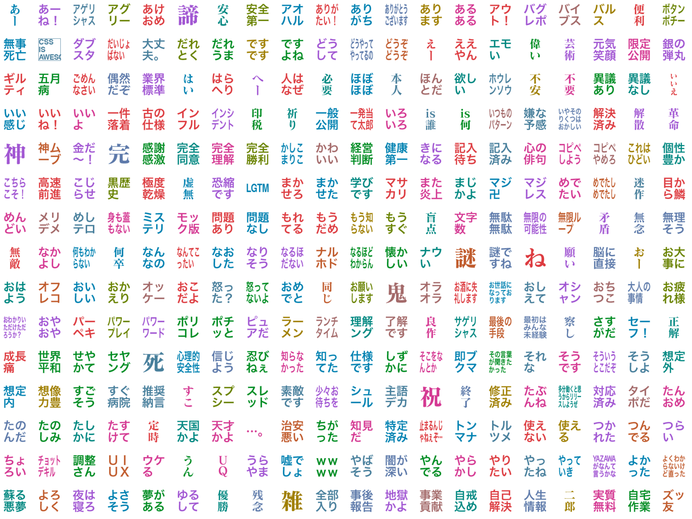
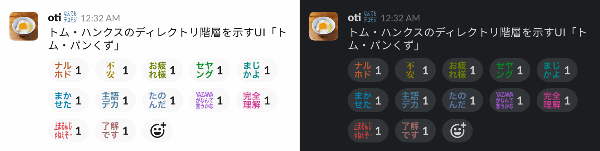
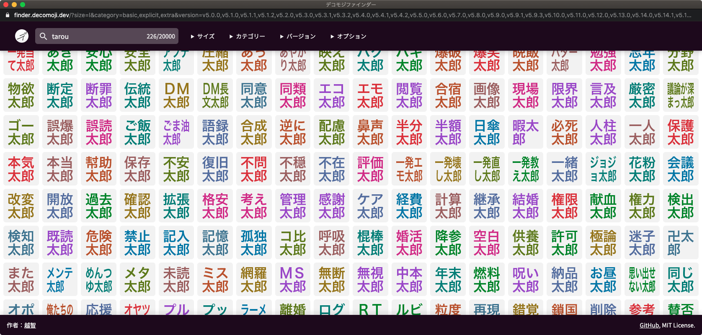

# decomoji v6

「デコモジ（decomoji）」は Slack のリアクション機能で使える最強カスタム絵文字セットです。このプロジェクトではそれら一つ一つを「デコモジ」と呼んでいます。



## デコモジの特徴

<dl>
<dt>🎨カラフルなテキスト画像</dt><dd>見やすい 12 のカラーパレットで Slack に彩を添えます！</dd>
<dt>🌓ダークモード対応</dt><dd>調整を重ねたカラーパレットで背景が暗くてもデコモジなら見えます！</dd>
<dt>🍱職人による割中レイアウト</dt><dd>2 行取りを基本に、文字数が多いものは 3 〜 5 行でレイアウトしました！</dd>
<dt>📦圧倒的な物量</dt><dd>まさに数の暴力！ 全体で 20000 個あるデコモジなら使いたいリアクションが必ず見つかります！</dd>
<dt>🤖登録と削除の自動化スクリプト</dt><dd>膨大なデコモジもコマンドラインから自動でインストールできます！</dd>
</dl>

デコモジはテキストを書き込んだ画像ファイルです。略語、字詰め、ワクワク感にこだわりました。

ハイコンテキスト！　だから使って楽しい！

デコモジはあなたのワークスペースに**カルチャーとベロシティを提供**します！



## まずは基本セットから始めましょう

デコモジには 3 つのカテゴリがあります。まずは基本セットの 300 個をあなたのワークスペースに登録してしばらく使ってみてください。

物足りなさを感じたら拡張セットも登録しましょう。Slack がもっと楽しくなります！

デコモジ一覧は下記ドキュメントで確認できますが、リンク先のドキュメントにアクセスすると**超大量に画像ファイルを通信する**のでご注意ください。

- [基本セット](docs/LIST-basic.md): すぐに使えて Slack が楽しくなるセットです。
- [拡張セット](docs/LIST-extra.md): 基本セットと合わせるとさらに Slack が便利で楽しくなるセットです。
- 露骨セット: 性的なもの、暴力的なもの、露骨な表現で使用には注意が必要なものを隔離したセットです。多くの場合、使わない方が良いです。

## デコモジを探す

「この言葉ってデコモジにあったっけ？」デコモジが多すぎでわからなくなりますよね。

そんな時は[デコモジファインダー](https://finder.decomoji.dev/?size=ll&category=basic)を使ってみてください。正規表現でも検索できます！



## ワークスペースへの登録方法

**カスタム絵文字の登録・削除には権限が必要です。**

デコモジをあなたのワークスペースに登録する方法は 3 つあります。

1. 絵文字登録ページのフォームから一つずつ登録する
2. Chrome 用のエクステンション [Slack Custom Emoji Manager](https://chrome.google.com/webstore/detail/slack-custom-emoji-manage/cgipifjpcbhdppbjjphmgkmmgbeaggpc) で Drag&Drop で登録する
3. スクリプトでコマンドラインから一括登録・削除する

次のセクションで 3 つ目の方法について解説しています。

### スクリプトでコマンドラインから一括登録・削除する

この操作はエンジニア向けです。実行には Node.js v26.10.0（`.node-version` に記載）が必要です。

プロジェクトルートで依存パッケージをインストールしてから、登録スクリプトを実行してください。

```bash
git clone git@github.com:decomoji/decomoji.git
cd decomoji
npm ci
npm run launch
```

対話式でワークスペースのサブドメイン、メールアドレス、パスワード、実行モード、デバッグモードの有無を入力すると、ブラウザを自動操作して処理が始まります。

2FA を有効にしている場合は、ログインのたびに認証コードを聞かれます。追加・削除・エイリアス登録でそれぞれログインし直すため、1 回の実行で複数回聞かれることがあります。また、Slack のレート制限にかかると待ちながら進むので、数時間かかる可能性があります。

### 実行モード

| モード         | こんな時に                                                  | 行う処理                                                                             |
| :------------- | :---------------------------------------------------------- | :----------------------------------------------------------------------------------- |
| 更新           | v6 を初めて入れる時、v6 を最新にする時                      | 前回の実行から追加・修正・削除されたデコモジだけを処理する。初回は v6 を全て追加する |
| 全削除         | デコモジを使うのをやめる時                                  | v4・v5・v6 で配布したデコモジを全て削除する                                          |
| 移行           | v4 か v5 を入れているワークスペースを v6 に切り替える時     | v4・v5 で配布したデコモジを全て削除してから、v6 を全て追加する                       |
| 互換のある移行 | 移行に加えて、v5 の名前でもデコモジを使えるようにしておく時 | 移行の処理に加えて、v5 の名前を v6 のデコモジのエイリアスとして登録する              |

v4 か v5 を入れているワークスペースで初めて v6 を入れる場合は、「移行」か「互換のある移行」を選んでください。

削除はワークスペースの権限の範囲で行われます。

### v6 のデコモジ名

v6 ではデコモジの名前が `表記_訓令式_ヘボン式` の形になりました。どの読み方で入力しても引き当てられます。

- `安心` は `:安心_annsinn_anshin:`
- `よかった` は `:よかった_yokatta:`（訓令式とヘボン式が同じ場合は重ねません）

v5 までは `:annsinn:` のような訓令式だけの名前でした。「互換のある移行」を選ぶと、v5 の名前が v6 のデコモジへのエイリアスとして残るので、過去のメッセージに付いたリアクションや、v5 の名前で入力する習慣をそのまま活かせます。

### 露骨セットを扱う

露骨セットはデフォルトでは追加も削除もしません。扱う場合は `--include-nsfw` オプションを付けて実行してください。

```bash
npm run launch -- --include-nsfw
```

**全削除でも、このオプションを付けないと露骨セットは削除されません。**

### 実行結果と失敗した時

実行結果は `logs/history.json` に保存されます。次回の「更新」はこのファイルを基準に差分を取るので、消さないでください。

途中で失敗した場合も、そこまでの結果が `logs/history.json` に残ります。原因を取り除いてから、同じモードでもう一度実行してください。登録済みのデコモジはスキップされます。

設定ファイルで対話入力を省略する方法など、詳しくは[高度な管理方法](docs/ADVANCED.md)を参照してください。

## フー・ユーズ・デコモジ？

あなたの所属する組織のチームやコミュニティでデコモジが使われていたら、ぜひ「Who use decomoji?」リポジトリに追加して教えてください！

[who-use-decomoji](https://github.com/decomoji/who-use-decomoji)

## サポートするには

Patreon で支援を受け付けています。

<a href="https://www.patreon.com/bePatron?u=486549"></a>

## その他のドキュメント

- [高度な管理方法](docs/ADVANCED.md)
- [コントリビューティングガイドライン](docs/CONTRIBUTING.md)
- [デコモジファイルの命名規則](docs/NOTATIONS.md)
- [チェンジログ](docs/CHANGES.md)

## スペシャルサンクス！

これらのデコモジは、imaz 氏が作成した`:naruhodo:`に影響を受け生み出されました。改めて深く感謝を申し上げます。

[@imaz](https://github.com/imaz/), [@geckotang](https://github.com/geckotang/), [@ginpei](https://github.com/ginpei/), [@watilde](https://github.com/watilde/), [@matori](https://github.com/matori/), [@fukayatsu](https://github.com/fukayatsu/), [@maiha2](https://github.com/maiha2/), [@webcre8](https://github.com/webcre8/), [@masuP9](https://github.com/masuP9/), [@yuheiy](https://github.com/yuheiy), [@kubosho](https://github.com/kubosho) and All Contributors!

## ライセンス

Copyright (c) 2015 decomoji consortium and other contributors.

Under the [MIT License](LICENSE).
