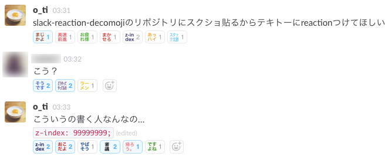
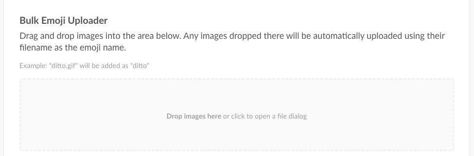
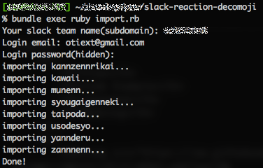

# Slack Reaction Decomoji v2

Slackリアクション機能で使えるカスタム絵文字のセットです。このプロジェクトではそれら一つ一つを「デコモジ」と呼んでいます。



これらのデコモジは、[@imaz](https://github.com/imaz)氏が作成した`:naruhodo:`に*強く*影響を受け生み出されました。

## 紹介スライド

イベントで使用したスライドにかえさせてください。PDFです。

[日本語Reactionｻｲｺｰ!!](promotion.pdf)

## 特徴

1. テキスト画像
2. だいたい4文字
3. 割注レイアウトで読みやすい
4. 色とりどり
5. JUMBOMOJIに対応
6. 高精細ディスプレイに対応

デコモジはテキストを書き込んだ画像ファイルです。日本語特有の「4文字略語」の文化を利用し、すばやくハイコンテキストなコミュニケーションをとることができるでしょう！

## v2は破壊的変更を含んでいます

### 1. JUMBOMOJIに対応

v2ではデコモジは64px角にサイズアップしました。

v1（無印）からのアップデートをしようとしているなら、既存のデコモジをSlackチームからあらかじめ削除しておく必要があります。Slackの設定画面ではカスタム絵文字の上書き保存はできませんので注意してください。

### 2. ファイル名の統一

ローマ字表記を[JIS X4063:2000で定義されたフォーマット](https://ja.wikipedia.org/wiki/%E3%83%AD%E3%83%BC%E3%83%9E%E5%AD%97%E5%85%A5%E5%8A%9B#.E5.BF.85.E3.81.9A.E5.AE.9F.E8.A3.85.E3.81.97.E3.81.AA.E3.81.91.E3.82.8C.E3.81.B0.E3.81.84.E3.81.91.E3.81.AA.E3.81.84.E5.85.A5.E5.8A.9B.E6.96.B9.E5.BC.8F)に統一しました。

## デコモジ一覧

[こちらのドキュメント](decomoji-list.md)に別記しています。

## インストール

**アカウントに権限が必要です。**

### マニュアルで登録する

[https://{{your-team-name}}.slack.com/customize/emoji](https://{{your-team-name}}.slack.com/customize/emoji)

ブラウザでSlackチームにログインし、フォームから登録してください。


### Chromeエクステンション

['Slack Emoji Tools'](https://chrome.google.com/webstore/detail/slack-emoji-tools/anchoacphlfbdomdlomnbbfhcmcdmjej) をGoogle Chromeにインストールすると、Drag&Dropでまとめて追加可能です。



### スクリプトで登録する

Rubyとbundlerが必要です。

```bash
$ git clone git@github.com:oti/slack-reaction-decomoji.git
$ cd slack-reaction-decomoji
$ bundle install
$ bundle exec ruby import.rb
```

コマンドラインで上記の手順で必要なモジュールをインストールしてください。

`import.rb`を実行すると、チーム名とあなたのアカウントとパスワードを聞かれるので、入力すると`decomoji/`にあるファイルが一つずつ登録されていきます。



## コントリビューティングガイドライン

[CONTRIBUTING_ja.md](CONTRIBUTING_ja.md)を参照してください。

## ライセンス

[](https://creativecommons.org/licenses/by-nc/3.0/deed.en)  
このプロジェクトは [CC BY-NC 3.0](http://creativecommons.org/licenses/by-nc/3.0/deed.en) ([Japanese](https://creativecommons.org/licenses/by-nc/3.0/deed.ja))の元にライセンスされています。非営利目的に限り自由に使用、改変、再配布が可能ですが、いずれもこのリポジトリへのリンクを示す必要があります。また、改変の場合は変更点を示さなければなりません。

## Special Thanks

[@imaz](https://github.com/imaz/)(オリジナルの`:naruhodo:`の作者)

[@geckotang](https://github.com/geckotang/)  
[@ginpei](https://github.com/ginpei/)  
[@watilde](https://github.com/watilde/)  
[@matori](https://github.com/matori/)  
[@fukayatsu](https://github.com/fukayatsu/)  
[@maiha2](https://github.com/maiha2/)